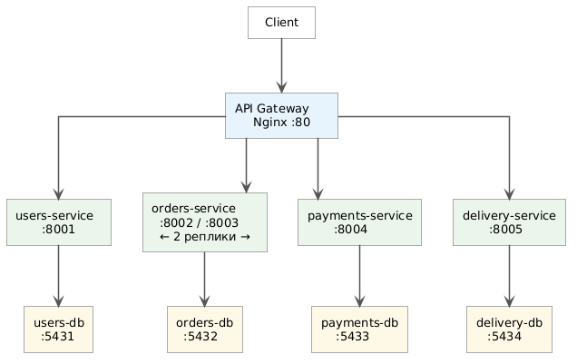
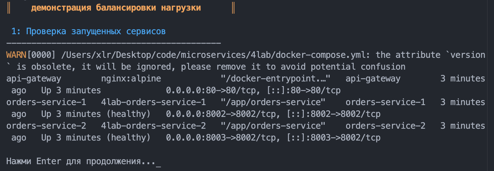
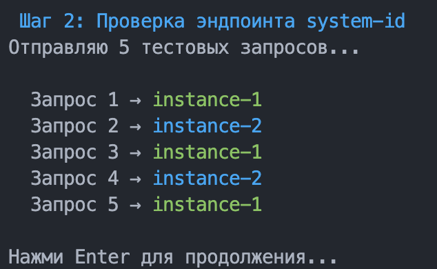
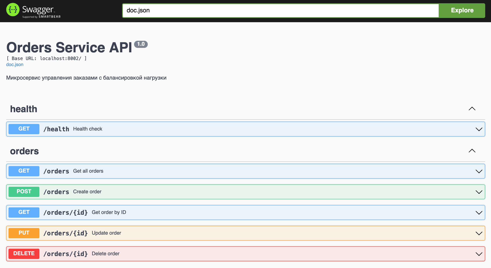

# Microservices Architecture Demo

---

## Описание

Этот проект демонстрирует микросервисную архитектуру, в которой **все межсервисные взаимодействия происходят ТОЛЬКО через API Gateway (Nginx)**.

Сервисы **не общаются напрямую** друг с другом. Gateway выступает как **единая точка входа** и **балансировщик нагрузки**.

---

## Architecture Overview



Система состоит из трёх слоёв. **Клиент** отправляет все запросы в единую точку входа — **API Gateway (Nginx :80)**, который маршрутизирует трафик и распределяет нагрузку. Каждый из четырёх **микросервисов на Go** имеет **собственную изолированную базу данных PostgreSQL** — сервисы не имеют доступа к чужим данным напрямую. Orders-сервис запущен в двух репликах (:8002 и :8003), Nginx распределяет между ними запросы по алгоритму round-robin.

---

## Ключевые принципы

- Отсутствие прямых вызовов между сервисами
- Весь HTTP-трафик проходит через API Gateway
- Балансировка нагрузки выполняется Nginx
- Orders-сервис работает в нескольких репликах
- У каждого сервиса своя собственная база данных

---

## Запуск проекта

```bash
docker-compose up --build
```

| Сервис           | URL                                      |
| ---------------- | ---------------------------------------- |
| API Gateway      | http://localhost:8080                    |
| Swagger users    | http://localhost:8001/swagger/index.html |
| Swagger orders   | http://localhost:8002/swagger/index.html |
| Swagger payments | http://localhost:8004/swagger/index.html |
| Swagger delivery | http://localhost:8005/swagger/index.html |
| pgAdmin          | http://localhost:5050                    |

---

## Демонстрация

### Шаг 1 — Проверка запущенных контейнеров



После `docker-compose up` поднимаются три ключевых контейнера: `api-gateway` (Nginx на порту 80), `orders-service-1` (порт 8002) и `orders-service-2` (порт 8003). Оба инстанса orders-сервиса имеют статус `healthy` и готовы принимать запросы через балансировщик.

---

### Шаг 2 — Round-robin балансировка



Скрипт `showbalance.sh` отправляет 5 тестовых запросов через API Gateway на эндпоинт `/system-id`. Nginx распределяет запросы между репликами по очереди: нечётные уходят на `instance-1`, чётные — на `instance-2`. Это классический round-robin без session persistence.

---

### Шаг 3 — Нагрузочный тест (50 запросов)


Массовая отправка 50 параллельных запросов подтверждает равномерное распределение: `instance-1` обработал 25 (50%), `instance-2` — 25 (50%). Итоговые логи контейнеров показывают суммарно 170 и 160 запросов соответственно — с учётом предыдущих шагов демонстрации.

---

## REST API

### Swagger UI — Orders Service



Каждый сервис имеет собственную Swagger-документацию. Orders Service предоставляет полный CRUD: `GET /orders`, `POST /orders`, `GET /orders/{id}`, `PUT /orders/{id}`, `DELETE /orders/{id}`. Доступна по адресу `localhost:8002` напрямую или через Gateway.

---

## Взаимодействие сервисов

Каждый сервис использует переменную окружения:

```
GATEWAY_URL=http://api-gateway
```

### Пример: users-service → orders-service

```
users-service
    |
    | HTTP-запрос:
    | http://api-gateway/api/orders/user/{id}
    |
    v
API Gateway (Nginx)
    |
    | балансировка нагрузки
    |
    v
orders-service (реплика)
```

Вся логика маршрутизации выполняется **на стороне Nginx**, а не в коде сервисов.

---

## Демонстрационный скрипт

**Файл:** `showbalance.sh` (корень проекта)

```bash
chmod +x showbalance.sh
./showbalance.sh
```

Скрипт проходит 3 фазы: проверка контейнеров → round-robin тест → массовая нагрузка 50 запросов со статистикой распределения.

---

## Итог

Проект наглядно демонстрирует:

- Паттерн API Gateway
- Централизованную маршрутизацию
- Балансировку нагрузки (Nginx round-robin)
- Изоляцию сервисов и баз данных
- Горизонтальное масштабирование через Docker Compose replicas
